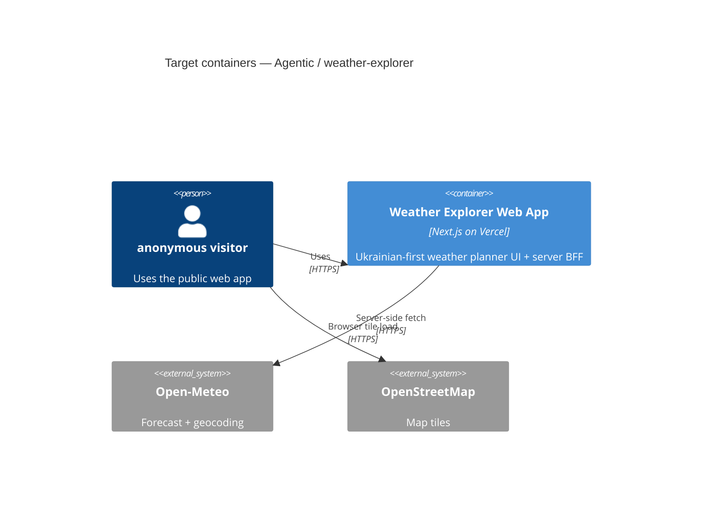

# Architecture map — Agentic

> **Live foundation** for the Agentic greenfield workshop repo. Scaffold materialized by
> `implement _scaffold` (2026-07-04). The first feature (`weather-explorer`) is designed; feature
> code lands on top of this skeleton. Refresh with `survey` after git is initialized and the first
> feature commit lands.

## Stack

- Language / runtime: TypeScript (strict) on Node.js 20+ LTS
- Frameworks: Next.js 15.5 App Router, React 19, Tailwind CSS 4, shadcn/ui (Button primitive), Vitest
- Maps: Leaflet + react-leaflet, OpenStreetMap raster tiles (client-only)
- Weather data: Open-Meteo forecast + geocoding (keyless, server-side BFF)
- Build / test / lint: `npm run build`, `npm test`, `npm run lint`, `tsc --noEmit`
- Deploy: Vercel (preview per PR, production on main)

## C4 — system as it is (target baseline)

## Module inventory

| Module | Path | Layers | Wired at | Responsibility |
|---|---|---|---|---|
| App shell | `app/` | routes, layouts, RSC loaders | `app/layout.tsx` | Next.js App Router entry, SSR shell |
| UI components | `components/` | presentation | `components/` | Feature UI + shadcn primitives |
| Domain lib | `lib/` | pure functions | `lib/` | Comfort scoring, i18n, jokes — framework-free |
| Weather integration | `lib/weather/` | server adapters | `lib/weather/` | Open-Meteo client wrappers (server-only) |
| Tests | `tests/` or `lib/**/*.test.ts` | unit | Vitest config | Pure function and adapter tests |
| Docs / SDD | `docs/` | specifications | `docs/features/` | Spec, SAD, ADRs — pipeline artifacts |

## Conventions (cited — the rules a new feature must match)

- **Module wiring / registration:** Next.js App Router file-based routing; server code in `app/` and `lib/weather/`; client components marked explicitly — `app/` layout (convention)
- **Error handling:** Calm inline UI states; distinguish zero-match vs provider outage — `docs/features/weather-explorer/spec.md` AC-02/AC-02b
- **IDs:** No application database; shareable location encoded in URL query — ADR `docs/features/weather-explorer/adr/0003-*`
- **Persistence / DB access:** None in MVP — stateless BFF + in-memory client cache — `docs/features/weather-explorer/sad.md` §7
- **Migrations:** N/A — no relational datastore in foundation
- **Tests:** Vitest unit tests for `lib/`; no Playwright in MVP — `docs/features/weather-explorer/sad.md` §2
- **Inter-module communication:** Direct function calls inside monolith; server fetches for external APIs — `docs/features/weather-explorer/sad.md` §5
- **UI / styling:** Tailwind 4 + shadcn/ui; Ukrainian-first copy from `lib/i18n/uk.ts` — `docs/features/weather-explorer/adr/0006-*`

## Datastores

| Store | Engine | Accessed via | Notes |
|---|---|---|---|
| *(none)* | — | — | MVP is stateless; no application database |

## Frontend / UI foundation

- **Component library / design system:** shadcn/ui in `components/ui/` — Button scaffolded; add Input/Card/Skeleton as features need them
- **Design tokens:** Tailwind 4 theme + CSS variables in `app/globals.css`
- **Styling approach:** Tailwind CSS 4 utility-first — `postcss.config.mjs` + `@import "tailwindcss"`
- **Shared primitives:** Button in `components/ui/button.tsx`; extend with shadcn CLI as needed
- **State / data-fetching:** URL query for active location; React client state for pins/compare; RSC + Route Handlers for server data
- **Closest UI precedent:** Scaffold hero at `app/page.tsx` (Ukrainian placeholder); weather-explorer replaces it

## Where things live / closest precedents

- A new web feature → `app/` + `components/<feature>/` + `lib/`, modelled on weather-explorer layout in `docs/features/weather-explorer/sad.md` §5
- A new pure domain rule → `lib/<domain>/` with Vitest tests, modelled on `lib/scoring/` (planned)
- SDD artifacts → `docs/features/<slug>/`

## Constraints & known tech-debt

- No application cookies, analytics, or trackers — privacy-first (spec §6.1)
- Open-Meteo fair-use and OSM tile policy must be respected
- Map component must load client-only (Leaflet SSR constraint) — feature ADR-0005
- Git not yet initialized — run `git init` before first commit; SAD targets Next 16.2 but scaffold ships Next 15.5 until create-next-app / workshop bump

## Reconciliation with the authored architecture doc

No repo-root `docs/architecture.md`; feature-level SAD at `docs/features/weather-explorer/sad.md` is the design reference this foundation implements. Foundational repo ADRs in `docs/adr/` capture irreversible bootstrap choices.
