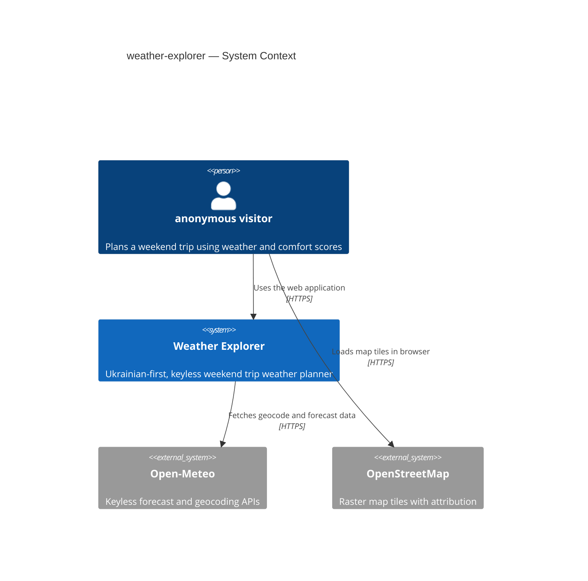
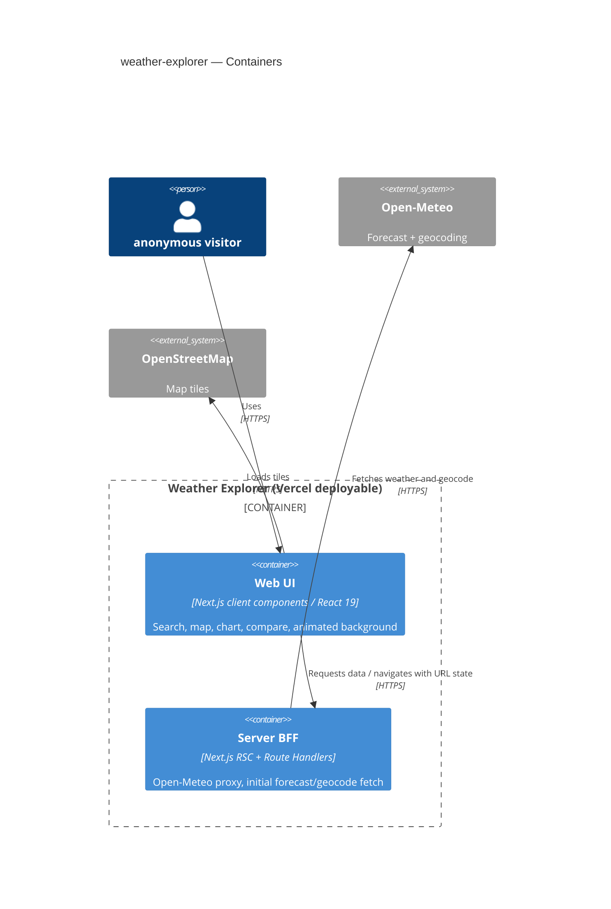
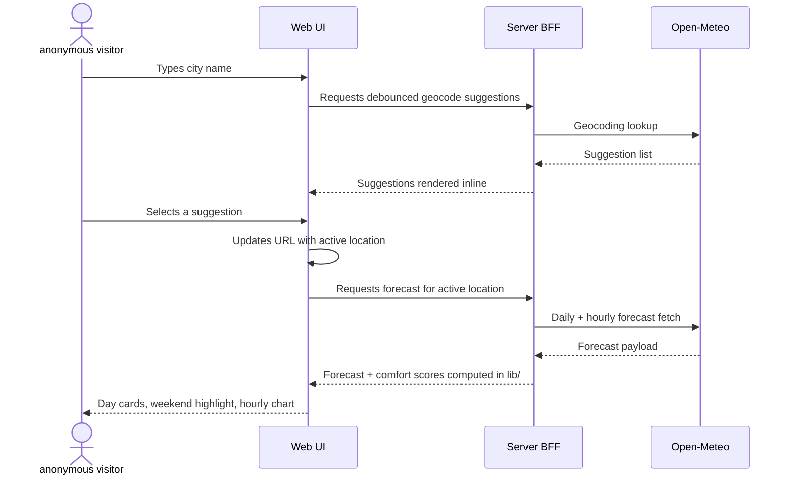
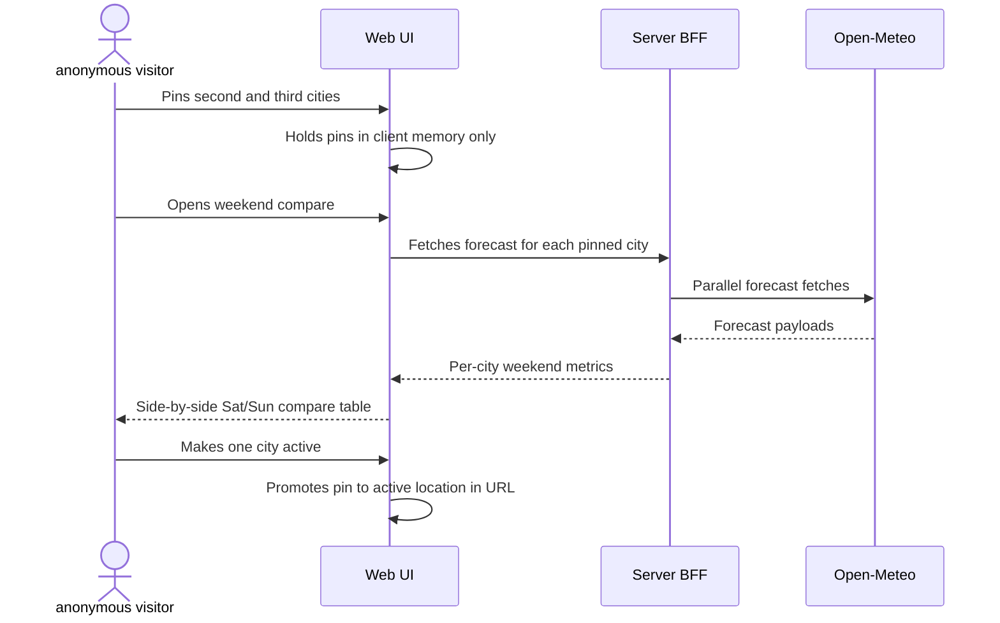
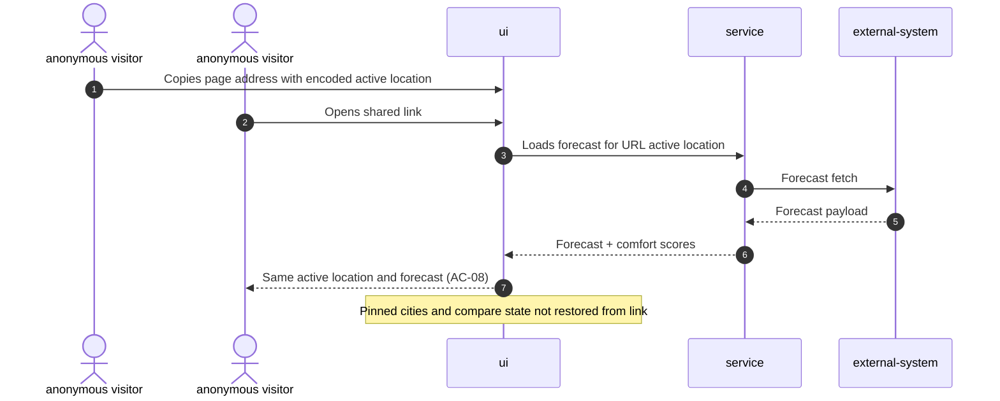
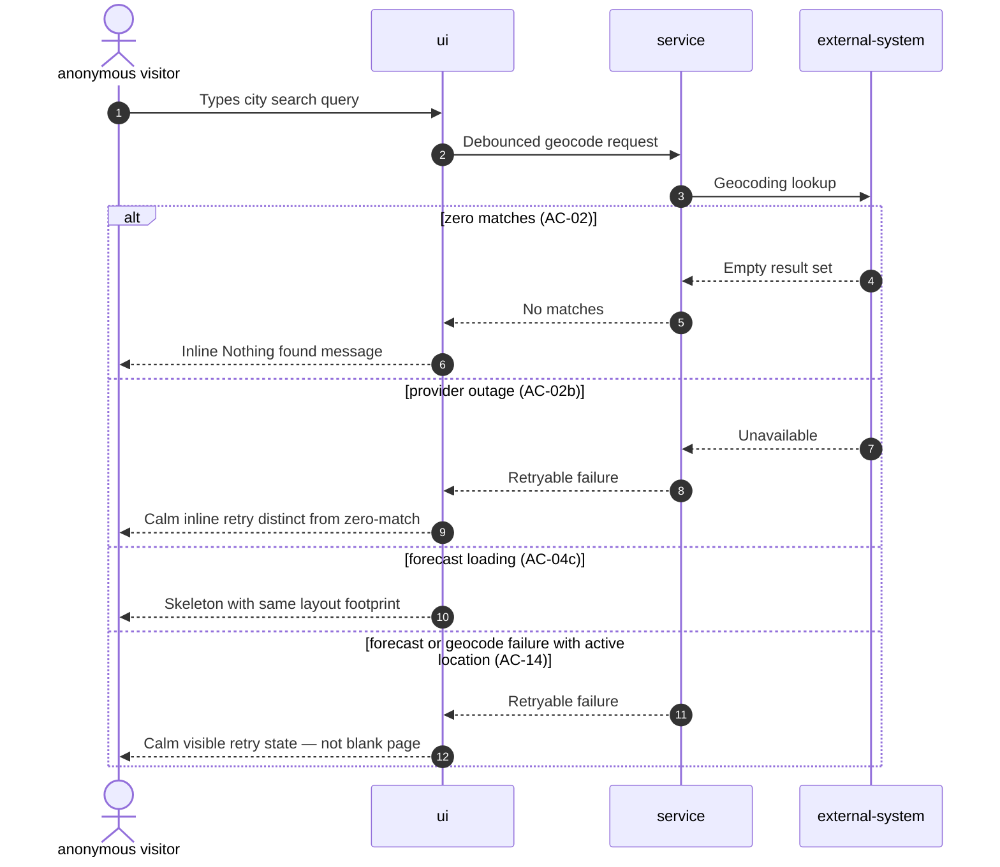
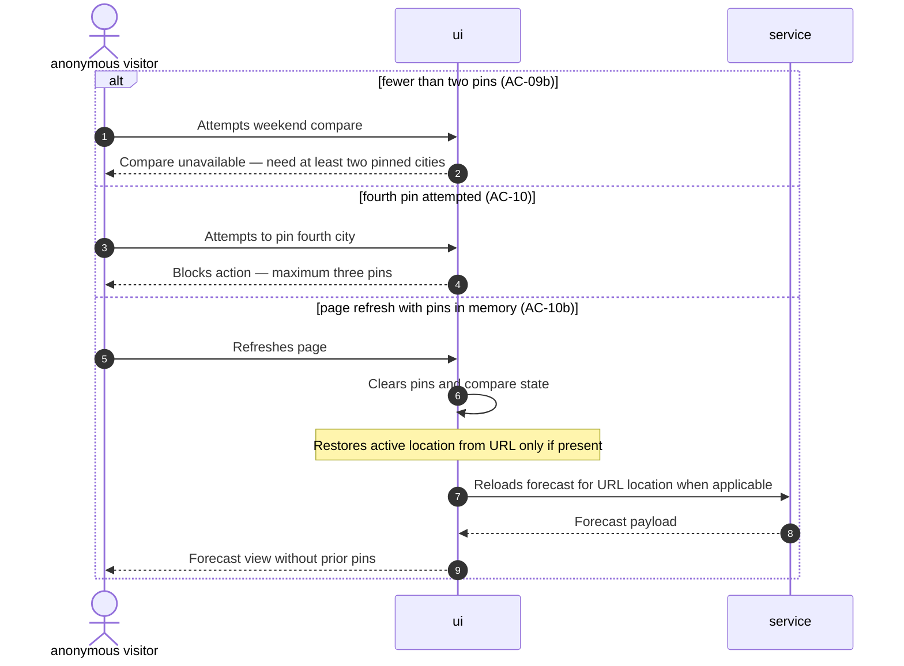
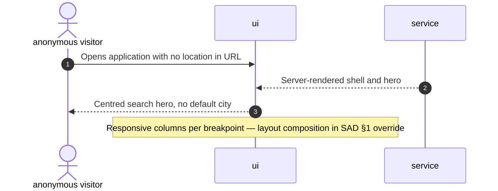

# Software Architecture Document — weather-explorer

> **UI design:** [ui.md](./ui.md) — panel placement and component anatomy (canonical for layout questions).

<!-- C4 Context (L1) in §3. C4 Container (L2) in §5. §10 numbers verbatim from spec §6 NFR. -->

## 1. Introduction and goals

**Intent.** Weather Explorer is a keyless, privacy-first, Ukrainian-first web application that helps an anonymous visitor decide whether — and where — a weekend trip is worth taking based on weather. The system combines a seven-day forecast, per-day comfort scoring with a highlighted weekend verdict, an interactive map, optional multi-city weekend comparison, and shareable link state — with no accounts, application cookies, analytics, or paid API keys.

**Top-3 quality goals (1-liners; full scenarios in §10):**

1. **Performance at first paint** — homepage and location views meet spec latency and Lighthouse targets so the decision screen feels instant on mobile preview and production.
2. **Privacy-by-design** — no visitor profile, no application-set cookies, geolocation only on explicit action; third-party weather lookups are proxied server-side where possible.
3. **Deterministic domain logic** — comfort scoring and Ukrainian rationale are pure, testable functions independent of the UI framework.

**Stakeholders.**

| Role | Interest | Sign-off owner? |
|---|---|---|
| anonymous visitor | Plans weekend trips using forecast, comfort, map, and compare | No |
| Tech Lead | SAD approval, workshop delivery | Yes |

**Decision overrides (¶4):**
- Decision override: responsive layout composition resolved — search hero centred on empty state; at `<768px` single column (search block → forecast block → map column with compare below map when open); at `768–1279px` two columns (left: search block with geolocation under search and pins below geolocation, forecast + chart; right: map + compare); at `≥1280px` three columns (left: search block; centre: forecast + chart; right: map + compare when active). Full panel anatomy in [ui.md](./ui.md). — rationale: closes spec §8 layout open question while preserving AC-16 breakpoint counts.

## 2. Constraints

**Technical.**
- TypeScript (strict mode), React 19.2, Next.js 16.2 App Router — workshop stack baseline.
- Tailwind CSS 4 (PostCSS plugin), shadcn/ui base-nova, class-variance-authority.
- Open-Meteo forecast + forward geocoding APIs for weather data; **Nominatim** (OpenStreetMap) for reverse geocode by coordinates (map click and opt-in geolocation); Leaflet + react-leaflet with OpenStreetMap raster tiles only.
- Vitest for unit tests on framework-free `lib/` code; no Playwright in MVP — browser verification via chrome-devtools MCP recordings.
- Vercel hosting with preview URL per pull request.
- No application database in MVP — stateless deployable; visitor state lives in URL query parameters and in-memory client state only.
- `lib/` must remain framework-free: no `next/*`, no `react`, no DOM globals.

**Organisational.**
- Workshop greenfield artifact — repo and live URL are primary demonstrable outputs.
- Effort budget: one M-sized feature epic (~1–2 sprints equivalent in workshop pacing).
- Single full-stack implementer profile acceptable for MVP delivery.

**Conventions.**
- Arc42 SAD + MADR ADRs under `docs/features/weather-explorer/`.
- Product UI strings centralised in static catalogues (`lib/i18n/uk.ts`, `lib/i18n/en.ts`) — Ukrainian-first, English fallback for missing keys only (spec §6 «UI string centralisation»).
- Error presentation: calm inline states — never generic error pages, never silent blanks (spec AC-14).
- Traceability: functional requirements referenced by stable `FR-*` / `BC-*` / `NFR-*` IDs in tests and PRs.

**Regulatory / external.**
- OpenStreetMap Tile Usage Policy — HTTPS tiles, visible attribution, valid Referer.
- Privacy posture: no analytics, no third-party trackers, no application cookies; geolocation only after explicit visitor action (spec §6.1, CONTEXT invariants).
- Footer must credit Open-Meteo and OpenStreetMap with hyperlinks (AC-17).

## 3. Context and scope

Weather Explorer serves anonymous visitors who open a public URL, optionally restore an active location from link state, and receive a calm Ukrainian-first weather decision surface. The system does not persist visitor identity server-side and does not operate background jobs or push notifications in MVP.

<!-- brownfield: N/A — greenfield repo; no application source or architecture-map yet. Workshop PRD TC-* constraints apply as greenfield bootstrap targets. -->

**External systems (in / out):**

| Actor or system | Type | Interaction |
|---|---|---|
| anonymous visitor | Person | Searches cities, reads forecast, uses map, compares weekends, shares links |
| Open-Meteo | System (external) | Geocoding, daily/hourly forecast — called from server BFF |
| OpenStreetMap | System (external) | Raster map tiles — loaded directly by the browser map component |
| Vercel platform | System (external) | Hosts the Next.js deployable, preview and production URLs |

**C4 Context (L1):**



## 4. Solution strategy

**Target surface(s):** `[web-frontend, backend-service]` — a Next.js deployable on Vercel where the browser UI (`web-frontend`) and the server BFF (`backend-service`: Server Components + Route Handlers) ship as one unit but are modeled separately for downstream contract and sequence work.

**Top strategic choices (the seeds for ADRs):**

1. **Hybrid Next.js delivery (RSC + client islands)** — Server Components render the initial shell, forecast skeleton, and SEO-safe empty state; interactive search, map, chart, compare, and animated background hydrate as client components. Rationale: meets spec «Time to first byte» and «Lighthouse Performance» targets while supporting Leaflet, geolocation, and rich client state with server-side weather access. → ADR-0001.

2. **Server-side BFF for Open-Meteo** — All forecast and geocoding calls go through Next.js server routes or Server Component loaders, not directly from arbitrary client bundles. Rationale: centralises error handling, enables calm degradation, supports future edge rate limiting without fingerprinting, and aligns with the privacy narrative (spec §6.1). → ADR-0002.

3. **URL-encoded active location + in-memory session state** — Shareable view encodes coordinates and display name in query parameters; pinned cities and compare mode live in React client state only until refresh. Rationale: satisfies AC-08 and AC-10b without cookies or server-side profiles. → ADR-0003.

4. **Framework-free domain core in `lib/`** — Comfort scoring, weekend highlight calculation, i18n string lookup helpers, and deterministic footer jokes are pure TypeScript modules fully covered by Vitest. Rationale: AC-18 and CONTEXT invariants require deterministic, testable domain logic isolated from Next.js and React. → ADR-0004.

5. **Client-only interactive map with SSR placeholder** — Leaflet map loads via dynamic import with a same-footprint skeleton during SSR and initial paint. Rationale: US-03 map interactions require browser APIs; placeholder preserves layout stability per AC-14 calm-degradation principle. → ADR-0005.

6. **Static i18n catalogues without a runtime i18n library** — Ukrainian strings are authoritative; English fills gaps only. Rationale: spec §6 «UI string centralisation» and workshop scope control. → ADR-0006.

## 5. Building block view

The application follows a **feature-sliced Next.js layout**: route segments and UI components in `app/` and `components/`, server data access in `app/` loaders and `app/api/` route handlers, and all business rules in framework-free `lib/`. There is no separate database module in MVP.

**Internal decomposition:**

```
weather-explorer/
├── app/                    # Next.js App Router pages, layouts, route handlers
│   ├── page.tsx            # Main shell + RSC data loading
│   └── api/                # BFF routes (geocode, forecast) if not inlined in RSC
├── components/             # UI: search, forecast grid, map, compare, background, shell
│   ├── ui/                 # shadcn/ui primitives
│   └── weather/            # feature components
├── lib/
│   ├── scoring/            # comfortScore, weekendHighlight (pure)
│   ├── weather/            # Open-Meteo client wrappers (server-only imports)
│   ├── i18n/               # uk.ts, en.ts catalogues
│   └── jokes/              # deterministic footer jokes
└── tests/                  # Vitest unit tests mirroring lib/
```

**C4 Container (L2):**



## 6. Runtime view

**Critical flow 1: Search city and load forecast**



**Critical flow 2: Pin cities and compare upcoming weekend**



### Flow: Set location via map click (US-03)

```mermaid
sequenceDiagram
    autonumber
    actor U as anonymous visitor
    participant UI as ui
    participant S as service
    participant X as external-system

    Note over U,UI: Precondition: map visible with attribution shown (AC-07)
    U->>UI: Clicks a point on the map
    UI->>S: Requests reverse geocode for coordinates
    S->>X: Reverse geocode lookup
    alt reverse geocode succeeds (AC-06)
        X-->>S: Place name and coordinates
        S-->>UI: Active location payload
        UI->>UI: Updates URL and recentres marker
        UI->>S: Requests forecast for new location
        S-->>UI: Forecast with comfort scores
        UI-->>U: Map popup, day cards, weekend highlight
    else reverse geocode fails (AC-06b)
        X-->>S: Failure or empty result
        S-->>UI: Error signal
        UI-->>U: Inline calm message and retry; prior location unchanged
    end
```

### Flow: Opt-in geolocation (US-06)

```mermaid
sequenceDiagram
    autonumber
    actor U as anonymous visitor
    participant UI as ui
    participant S as service
    participant X as external-system

    Note over U,UI: Precondition: first load complete — no geolocation yet (AC-11)
    U->>UI: Activates Use my location control
    UI->>UI: Requests browser geolocation permission
    alt permission granted
        UI->>S: Sends coordinates for geocode + forecast
        S->>X: Geocode and forecast fetch
        X-->>S: Location and weather payload
        S-->>UI: Active location + forecast
        UI->>UI: Updates URL
        UI-->>U: Forecast view for near-me location
    else permission denied or unavailable (AC-11b)
        UI-->>U: Inline guidance; previous active location unchanged
    end
```

### Flow: Open shareable link (US-04)



### Cross-cutting: Search and forecast error branches



### Flow: Compare guardrails and session refresh (US-05)



### Flow: Empty-state landing (US-07 / AC-16)



### AC → flow coverage

| AC | Shown in |
|---|---|
| AC-01, AC-03, AC-04, AC-04b, AC-05, AC-18 | Flow 1 (design seed) + Cross-cutting |
| AC-02, AC-02b, AC-04c, AC-14 | Cross-cutting: Search and forecast error branches |
| AC-06, AC-06b, AC-07 | Flow: Set location via map click |
| AC-08 | Flow: Open shareable link |
| AC-09, AC-04b | Flow 2 (design seed) |
| AC-09b, AC-10, AC-10b | Flow: Compare guardrails and session refresh |
| AC-11, AC-11b | Flow: Opt-in geolocation |
| AC-12 | Non-runtime N/A — no auth gate exists by design |
| AC-13, AC-15 | Non-runtime N/A — CSS/animation preference handled in UI layer at render |
| AC-16 | Flow: Empty-state landing |
| AC-17 | Non-runtime N/A — static footer content rendered with page shell |

**Flags for downstream:** No `<data-store>` persist steps — `data-model` may skip schema (stateless MVP). Existing design seed flows (Flow 1–2) retain concrete participant labels from the design pass; new flows use generic vocabulary per sequences skill.

## 7. Deployment view

Weather Explorer ships as a **single Next.js application** on Vercel. Production and preview environments share the same architecture; preview URLs are generated per pull request (TC-DEPLOY-01). No database, queue, or worker process is provisioned in MVP — horizontal scale is handled by Vercel's serverless/edge runtime.

**Monitoring:**
- Vercel deployment analytics for Time to First Byte (p95 target ≤ 300 ms on preview homepage — spec §6 NFR).
- Lighthouse CI on production URL for Performance ≥ 90 and Accessibility ≥ 95.
- Build pipeline gate: lint, typecheck, Vitest, and production build complete in under 60 seconds on a clean checkout.

**Scaling thresholds:**
- Stateless BFF routes scale with Vercel concurrency; no datastore partitioning required in MVP.
- Open-Meteo and OSM usage must respect free-tier fair use — edge rate limiting deferred to tasks stage (spec §8 open question) with calm client degradation on throttle.

## 8. Crosscutting concepts

| Concept | Convention | Where defined |
|---|---|---|
| Logging | Structured server logs on BFF fetch failures only; no client analytics | This SAD §4 + spec BC-PRIVACY-01 |
| Authentication | None — single anonymous actor, no sessions | spec §6.1 |
| Error handling | Domain-level calm states mapped to inline UI messages; distinguish zero-match vs provider outage (AC-02 vs AC-02b) | spec §5 + components |
| ID strategy | N/A — no persisted entities; locations identified by lat/lon/name in URL | ADR-0003 |
| Internationalisation | Static `uk.ts` / `en.ts` catalogues; Ukrainian-first | ADR-0006 |
| Observability | No third-party observability SDKs; rely on Vercel + Lighthouse + spec «Runtime console hygiene» | spec §6 |
| Caching | In-memory forecast cache per browser session until active location changes (AC-04b) | spec + Web UI state |
| Privacy | No cookies, no trackers, geolocation only on button click | CONTEXT invariants |

## 9. Architecture decisions

| # | Title | Status | Section |
|---|---|---|---|
| 0001 | Use Next.js App Router with RSC and client islands | Accepted | §4 |
| 0002 | Proxy Open-Meteo through a server-side BFF | Accepted | §4 |
| 0003 | Encode active location in URL query state | Accepted | §4 |
| 0004 | Keep comfort scoring in a framework-free lib module | Accepted | §4 |
| 0005 | Load the interactive map client-only with an SSR placeholder | Accepted | §4 |
| 0006 | Centralise UI strings in static i18n catalogues | Accepted | §4 |

ADR files live under `docs/features/weather-explorer/adr/`.

## 10. Quality requirements

**QG-1. Performance at first paint**
- **When:** An anonymous visitor opens the homepage or a shareable location link on Vercel Preview or production.
- **Then:** Time to first byte ≤ 300 ms at p95 on the homepage; Lighthouse Performance ≥ 90 on mobile and desktop; initial client JavaScript payload ≤ 200 KB gzipped.
- **How verify:** Vercel Preview deployment metrics; Lighthouse CI on production URL; build artifact size check in CI.

**QG-2. Accessibility and calm UX**
- **When:** The visitor navigates search, forecast, map, and compare using keyboard and screen reader.
- **Then:** Lighthouse Accessibility ≥ 95; all interactive elements have visible focus styles and accessible names; color palette meets WCAG AA contrast in light and dark themes.
- **How verify:** Lighthouse CI; automated contrast audit; manual accessibility smoke on preview.

**QG-3. Privacy and runtime hygiene**
- **When:** A healthy session runs through search, forecast, map, and opt-in geolocation flows.
- **Then:** Zero application-set cookies; zero analytics or tracker scripts; geolocation never requested on first load; runtime console shows zero warnings and zero errors; zero paid API keys for third-party data.
- **How verify:** Privacy checklist before demo; browser devtools console check; dependency and deployment config review for paid keys.

**QG-4. Developer gate speed**
- **When:** A developer runs the standard CI gate on a clean checkout.
- **Then:** lint, typecheck, unit tests, and production build complete in under 60 seconds.
- **How verify:** CI pipeline wall-clock time measurement on clean checkout.

## 11. Risks and technical debt

| Risk / debt | Severity | Mitigation | Owner |
|---|---|---|---|
| Open-Meteo rate limits or outage under workshop traffic | Medium | Server BFF with calm retry UI; edge rate limit decision before tasks (spec §8) | Tech Lead |
| Comfort score distrust if forecast shifts near weekend | Medium | Factual Ukrainian rationale per AC-18; optional copy tweak before implement (spec §8) | Product |
| Map SSR/hydration complexity with Leaflet | Low | ADR-0005 client-only dynamic import + skeleton footprint | Frontend Lead |
| No analytics makes compare funnel invisible | Low | Accept for MVP privacy posture; moderated usability sessions for KPIs | Product |
| Open architectural decision: comfort rationale uncertainty wording | Open question | Resolve before sdd:implement; default factual 80-char sentence | Product |
| Open architectural decision: hosting edge rate limit threshold | Open question | Resolve before sdd:tasks; generous anonymous limits with calm degradation | Tech Lead |

**Accepted debt (acceptable in v1, plan to fix later):**
- Pinned cities not persisted across refresh — intentional per clarify resolution (AC-10b).
- No automated Playwright e2e — chrome-devtools MCP recordings used for workshop verification instead.

## 12. Glossary

| Term | Meaning |
|---|---|
| anonymous visitor | Person using the public URL without sign-in or server-side profile |
| active location | City or map point driving forecast, comfort, map, background, and URL state |
| pinned city | Comparison candidate held in client memory only (max three) |
| comfort score | Deterministic 0–100 rating with Ukrainian rationale sentence |
| weekend highlight | Mean comfort of upcoming Sat–Sun in the location timezone |
| shareable view | URL-restorable active location only — not pins or compare state |
| Server BFF | Next.js server layer proxying Open-Meteo and assembling page data |
