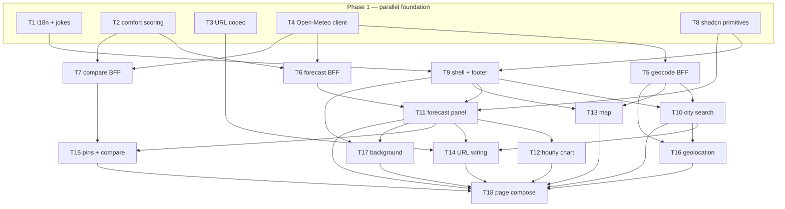

# Epic — weather-explorer

> **Spec:** [spec.md](../spec.md) · **Design:** [sad.md](../sad.md) · **API:** [openapi.yaml](../contracts/openapi.yaml) · **ADRs:** [adr/](../adr/)

## Goal

Ship a keyless, privacy-first, Ukrainian-first weekend trip weather planner: search or map a place, read seven days with comfort scores and a highlighted weekend verdict, pin up to three cities for side-by-side comparison, and share the active location via URL — all without accounts, cookies, or paid API keys.

## Scope

- **In:** Framework-free domain (`lib/scoring`, `lib/i18n`, `lib/url-state`), Open-Meteo BFF routes (`app/api/v1/`), feature UI (`components/weather/`), responsive shell wiring (`app/page.tsx`).
- **Out:** User accounts, database, analytics, Playwright e2e, localization beyond Ukrainian + English fallback, native mobile app (spec §3).

## Task map

## Tasks

See [tracker.md](./tracker.md) for status. Machine contract: [tasks.json](../tasks.json).

| # | Task | Layer | Blocked by | DoD (short) |
|---|---|---|---|---|
| T1 | i18n catalogues + footer jokes | domain | — | Vitest for uk/en + jokes |
| T2 | Comfort scoring + weekend highlight | domain | — | Vitest for AC-05/AC-18 rules |
| T3 | URL location codec | domain | — | Vitest round-trip, no pins in URL |
| T4 | Open-Meteo client wrappers | infra | — | Mocked-fetch Vitest, server-only |
| T5 | Geocode BFF routes + errors | ports | T4 | OpenAPI-aligned handlers |
| T6 | Forecast BFF route | ports | T2, T4 | ForecastBundle + comfort |
| T7 | Weekend-compare BFF route | ports | T2, T4 | POST compare for 2–3 cities |
| T8 | shadcn Input, Card, Skeleton | ui | — | Primitives importable |
| T9 | Shell, hero, footer | ui | T1, T8 | Responsive hero + credits |
| T10 | City search combobox | ui | T5, T9 | Debounce + calm errors |
| T11 | Forecast panel + skeleton | ui | T6, T9, T8 | Day cards + weekend headline |
| T12 | Hourly chart | ui | T6, T11 | 48h chart + sunrise/sunset |
| T13 | Client-only map | ui | T5, T9 | OSM attribution + click |
| T14 | URL state wiring | wiring | T3, T10, T11 | Share link + cache discard |
| T15 | Pins + compare UI | ui | T7, T11, T8 | Guardrails AC-09b/AC-10 |
| T16 | Geolocation control | ui | T5, T10 | Opt-in only, calm denial |
| T17 | Background + local clock | ui | T11, T9 | Animation + reduced motion |
| T18 | Main page composition | wiring | T10–T17 | Breakpoint layout + build green |

## Risks / Hard rules

- **`lib/` stays framework-free** — no `next/*`, `react`, or DOM in domain modules (sad §2, ADR-0004).
- **No application cookies, analytics, or auto geolocation** — privacy invariants (spec §6.1, AC-11, AC-12).
- **Calm inline errors only** — distinguish zero-match (AC-02) from provider outage (AC-02b); never generic error pages (AC-14).
- **Open-Meteo BFF only** — browser never calls Open-Meteo directly for forecast/geocode (ADR-0002).
- **Rate limiting default (spec §8 OQ):** generous anonymous edge limits with calm 503 degradation — document chosen threshold in `lib/errors` or route comments during T5 if not set earlier.
- **Comfort rationale uncertainty (spec §8 OQ):** default factual 80-char Ukrainian sentence per AC-18 until Product resolves copy.
