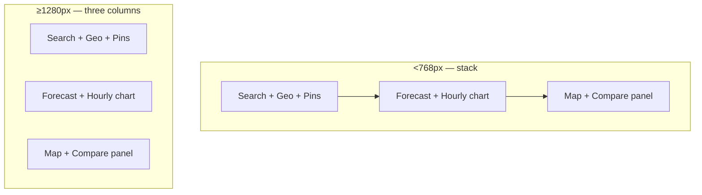

# UI design — weather-explorer

> **Upstream:** [spec](./spec.md) acceptance criteria, [SAD §1 layout override](./sad.md), [i18n catalogue](../../../lib/i18n/uk.ts)
> **Implementation:** `components/weather/`

Canonical reference for panel placement, component anatomy, and visual patterns shipped in MVP. When spec AC wording and this document differ, **this document reflects the implemented design** unless Product reopens the AC.

## Principles

- **Calm and readable** — muted borders, soft badge tints, inline errors (no toasts), skeleton placeholders with the same footprint as loaded content.
- **Ukrainian-first copy** — all product strings from `lib/i18n/uk.ts`; no exclamation marks in product strings (CONTEXT invariant).
- **shadcn-style primitives** — `Card`, `Button`, `Skeleton` from `components/ui/`; Tailwind 4 utility layout.
- **Lightweight charts** — inline SVG for the hourly temperature series (no heavy charting library; NFR JS budget).

## Responsive layout

Breakpoints follow Tailwind defaults: `md` = 768px, `xl` = 1280px.

| Viewport | Grid | Column assignment (when active location set) |
|---|---|---|
| `<768px` | Single column | Search block → forecast block (day cards + hourly chart) → map column (map, then compare when open) |
| `768–1279px` | `md:grid-cols-2` | **Left:** search block (search, geolocation, pins). **Right (row-span 2):** map + compare. **Left row 2:** forecast + chart |
| `≥1280px` | Three columns `1fr / 1.4fr / 1fr` | **Left:** search block. **Centre:** forecast + chart. **Right:** map + compare |

**Empty state (`location === null`):** centred hero in a single column — tagline (`app.tagline`), helper text (`app.heroEmpty`), city search, and geolocation button. No forecast, map, or pins until a location is chosen (AC-16).

## Search block

**File:** `components/weather/weather-app.tsx` → `SearchBlock`

| Element | Placement | Notes |
|---|---|---|
| Hero title + subtitle | Top of search column | Only when no active location |
| City search input | Below hero / first in block | Debounced 300ms; suggestions list inline |
| Geolocation control | **Directly below search** | Outline `sm` button — `geolocation.useMyLocation` («Моє місцезнаходження») |
| Pin chips + compare trigger | **Below geolocation** | Only when active location is set |

Geolocation is **not** in the map toolbar or header — it lives in the search column so empty-state and loaded-state flows share one entry point (AC-11).

## Geolocation control

**File:** `components/weather/geolocation/geolocation-control.tsx`

- **Trigger:** outline button, disabled while resolving.
- **Success:** sets active location via BFF reverse geocode → updates URL → loads forecast.
- **Permission denied / unavailable:** inline status text (`geolocation.denied`); prior location unchanged; no toast (AC-11b).
- **Reverse geocode failure:** inline message (`map.reverseFailed` or provider-unavailable copy); **Retry** button reuses last coordinates (same pattern as map/search retry).

Reverse geocode is served by the BFF using **Nominatim** (OpenStreetMap), not Open-Meteo — see `lib/weather/geocode.ts`.

## Pins and compare trigger

**File:** `components/weather/pins/pin-chips.tsx`

- **Pin active city:** outline button «Закріпити {name}».
- **Pinned cities:** rounded-full chips with flag emoji, city name, × unpin control.
- **Fourth pin:** blocked; amber inline message for 3s (`pins.tooMany`).
- **Compare unavailable hint:** muted text when exactly one pin (`pins.compareDisabled`).
- **Compare button:** primary `sm` button «Порівняти вихідні» — disabled until ≥2 pins (AC-09b); opens compare panel in map column (does not navigate away).

Pins are **not** rendered above the day-card grid; they stay in the search column per layout table above (resolves prior doc gap «chips above forecast»).

## Forecast panel

**File:** `components/weather/forecast/forecast-panel.tsx`

### Weekend highlight card

- Top of forecast block; `border-primary/30 bg-primary/5` emphasis card.
- Title: `forecast.weekendHighlight` («Вихідні»).
- **Comfort presentation:** `layout="inline"` — numeric score in coloured circle **left**, Ukrainian rationale sentence **right** (horizontal row).

### Day cards

- Responsive grid: `grid-cols-2` → `sm:3` → `lg:4` → `xl:3` → `2xl:4`; min height 160px.
- Header: localized weekday + weather icon (glyph + `aria-label`).
- Body: high/low °C; precip % and wind on muted line.
- **Comfort badge (`layout="stack"`, `compact`):**
  - Score: centred **circle** (`rounded-full`, `size-9`, tabular nums) with threshold colours (AC-18): emerald ≥70, amber 40–69, red <40.
  - Rationale: **below** the circle, centred, `text-[11px]`, `text-balance` — avoids cramming long rationale inside the pill.

### Loading / error

- Skeleton: weekend strip + day-card grid matching loaded footprint (AC-04c).
- Provider error: centred card with retry link.

## Hourly temperature chart

**File:** `components/weather/chart/hourly-chart.tsx`  
**Data:** `lib/weather/forecast.ts` — 48 hourly points from **local midnight (00:00)** of the current day, not from the current clock hour.

### Chart card

- Rounded card with header row: title `forecast.hourlyTitle` («Температура на 48 годин») + min–max range (`{min}° – {max}°C`).
- **SVG area chart:** primary-colour line, gradient fill under curve, horizontal grid at 25/50/75% of plot height.
- **Y-axis:** min/max temperature labels at top-left and bottom-left of plot area.
- **X-axis:** tick labels every **6 hours** starting at **00:00**, plus final hour label (typically **23:00** on day two); small vertical tick marks on the baseline. Tabular-nums, 10px, muted opacity.
- **No sunrise/sunset markers on the chart line** — astronomy is shown in the block below, not as icons overlaid on the series.

### Astronomy row (below chart)

Three-column grid on `sm+`:

| Left | Centre | Right |
|---|---|---|
| Sunrise chip (🌅, label, local time, hint) | Daylight duration (dashed border, `forecast.daylightLabel`) | Sunset chip (🌇, label, local time, hint) |

Times formatted in active location local time via `lib/astronomy/`.

## Compare panel

**File:** `components/weather/compare/compare-panel.tsx`  
**Placement:** map column, **below** the map (`WeatherShell` map section).

- Rendered only when compare is open **and** ≥2 pins.
- Card header: title + close (×) button.
- Table: one column per pinned city; sticky header with city name + «Зробити активним» outline button.
- Rows: Saturday and Sunday — weekday label, high/low °C, precip %, comfort score value.
- Loading / error states with retry (same calm pattern as forecast).

## Map column

**File:** `components/weather/map/`

- Leaflet map with OSM tiles; attribution always visible (AC-07).
- SSR placeholder skeleton during dynamic import (ADR-0005).
- Compare panel stacks beneath the map when opened — not a modal or separate route.

## Comfort badge colour tokens

Shared `ComfortBadge` component:

| Threshold | Tailwind tint |
|---|---|
| ≥ 70 | `bg-emerald-500/20 text-emerald-700 dark:text-emerald-300` |
| 40–69 | `bg-amber-500/20 text-amber-700 dark:text-amber-300` |
| < 40 | `bg-red-500/20 text-red-700 dark:text-red-300` |

Rationale: one Ukrainian sentence, ≤80 characters, no emoji, no `!` (AC-18).

## Design change log (2026-07-04)

| Area | Original spec / doc intent | Shipped design |
|---|---|---|
| Hourly chart anchor | 48h from current local hour (AC-04 draft) | 48h from **00:00** local today; x-axis ticks every 6h |
| Hourly astronomy | Sunrise/sunset noted under chart | Chip row + daylight duration; **no** chart overlay markers |
| Comfort badge (day cards) | Score + rationale in badge | Stacked: circle score on top, rationale below |
| Comfort badge (weekend) | Same as day cards | Inline row: score left, rationale right |
| Pin placement | «Above forecast» (AC-09 draft) | Search column below geolocation |
| Compare trigger | Weekend compare control (unspecified placement) | Button in pin chips block; panel under map |
| Geolocation placement | «Near search» (T16) | Immediately under city search input |
| Reverse geocode (geolocation + map) | Open-Meteo implied | Nominatim via BFF with User-Agent policy |
